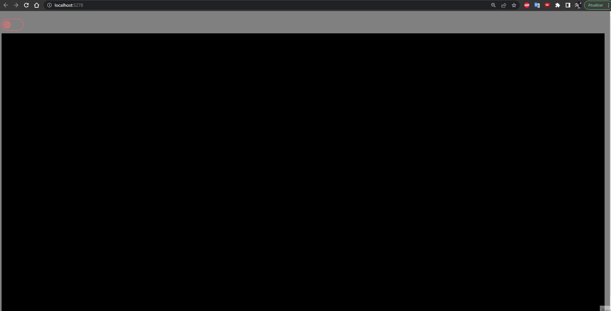

# Sobre

Projeto feito com intuito de concretizar o aprendizado de grafos.

## Build

Basta clonar o repositório e executar o projeto. 

Pode ser feito atráves do visual studio ou da .NET CLI se você for muito hacker.

Por padrão o projeto vai subir na porta 5278. Você pode altera-la em Properties/launchSettings.json.